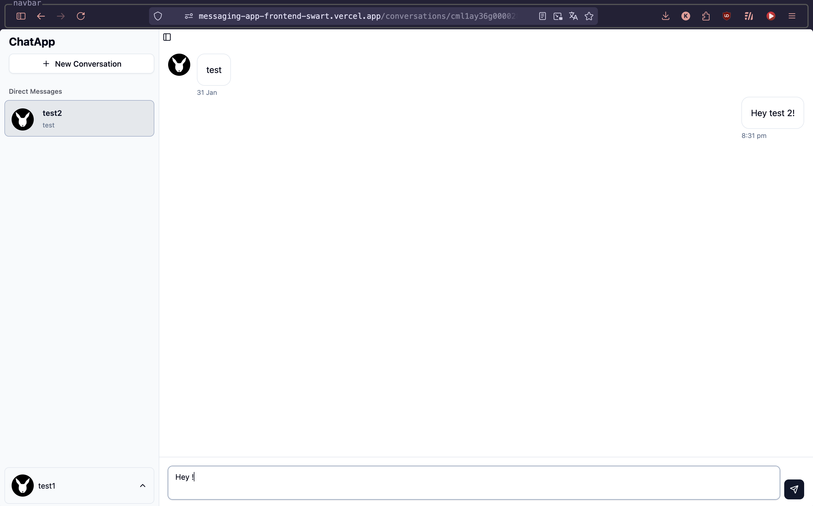

# Messaging App

A real-time messaging application built as a monorepo with a React frontend and Express backend, featuring WebSocket-powered live chat.

## Live Demo

[https://messaging-app-frontend-swart.vercel.app/](https://messaging-app-frontend-swart.vercel.app/)

**Test Account:**

- Email: `test1@example.com`
- Password: `testpassword123`

## Screenshot



## Tech Stack

**Frontend:** React, TanStack Router, Socket.IO Client, Tailwind CSS, Radix UI, Zustand, Vite

**Backend:** Express 5, Socket.IO, Prisma (PostgreSQL), Better Auth, Zod

**Shared:** `@monorepo/shared` package for shared schemas and types

## Project Structure

```
messaging-app/
├── apps/
│   ├── backend/       # Express API server with Socket.IO
│   └── frontend/      # React SPA
├── packages/
│   └── shared/        # Shared Zod schemas and types
└── package.json       # Workspace root
```

## Features

- User authentication (sign up, login) via Better Auth
- Real-time messaging with Socket.IO
- Conversations with participants
- Typing indicators
- User presence tracking

## Getting Started

### Prerequisites

- Node.js 20+
- PostgreSQL database

### Installation

```bash
npm install
```

### Environment Variables

Create `.env` files in `apps/backend/` and `apps/frontend/` with the required configuration:

**Backend (`apps/backend/.env`):**

- `DATABASE_URL` — PostgreSQL connection string
- `FRONTEND_URL` — Frontend origin for CORS
- `BETTER_AUTH_URL` — Auth server URL
- `BETTER_AUTH_SECRET` — Auth secret key

**Frontend (`apps/frontend/.env`):**

- `VITE_API_URL` — Backend API URL

### Database Setup

```bash
cd apps/backend
npx prisma migrate deploy
npx prisma generate
```

### Development

```bash
npm run dev
```

This starts both the frontend and backend in watch mode.

### Production Build

```bash
npm run build
```

## CI/CD

A GitHub Actions pipeline runs on pushes and PRs to `main`, performing dependency installation, builds, and type checks.

The PostgreSQL database and backend are hosted on [Railway](https://railway.app/), while the frontend is deployed on [Vercel](https://vercel.com/).
